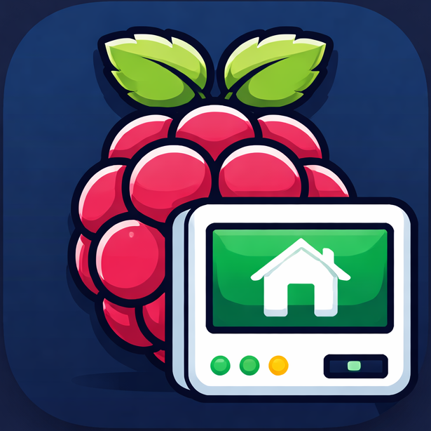

<div align="center">
  
</div>

# Homelab Portal 🏠

A lightweight, containerized dashboard for monitoring and managing your Raspberry Pi homelab. Built with React, Node.js, and Docker.

<div align="center">

## Features

</div>

- **Real-time System Monitoring**
  - CPU load and usage
  - Memory (RAM) usage
  - CPU temperature
  - Disk usage per mount point
  - Process monitor with search, sort, and filtering
  - Live network traffic (upload/download speeds per interface)
- **Docker Container Management**

  - View all containers (running and stopped)
  - Container status and health
  - Port mappings
  - Real-time updates

- **Service Quick Links**

  - Add/Edit/Delete custom service links
  - Organize services by category
  - One-click access to all your homelab services
  - SQLite database for persistent storage

- **Auto-refresh Dashboard**
  - Choose refresh interval for auto refresh dashboard
  - Responsive design for mobile and desktop

- **Customizable Dashboard Layout**

  - Drag-and-drop panel reordering
  - Collapsible panels with state persistence
  - Two-column layout with independent organization
  - User preferences saved to localStorage

- **Performance Optimizations**
  - Lazy loading: collapsed panels skip data fetching
  - Centralized data fetching to minimize API calls
  - Memoized components and calculations
  - Backend response caching for system metrics
  - Efficient process monitoring with UID caching

- **Real-time WebSocket Support**
  - Per-panel toggle between polling and real-time mode
  - WebSocket server with change detection (only pushes significant changes)
  - Auto-reconnection with exponential backoff
  - User preferences persist in localStorage

<div align="center">

## Tech Stack

</div>

- **Frontend**: React 18 + Vite, Tailwind CSS, Recharts, Lucide Icons, dnd-kit
- **Backend**: Node.js + Express + ws (WebSocket)
- **Database**: SQLite (better-sqlite3)
- **Monitoring**: systeminformation, dockerode
- **Deployment**: Docker + Docker Compose

<div align="center">

## Prerequisites

</div>

- Docker and Docker Compose installed on your Raspberry Pi
- Raspberry Pi running a Linux-based OS (Raspberry Pi OS recommended)
- Port 1781 available for the frontend
- Port 3001 available for the backend API

<div align="center">

## Quick Start

</div>

### 1. Clone or Download

```bash
git clone https://github.com/JasonNuttall/PiPortal.git
cd PiPortal
```

### 2. Build and Run with Docker Compose

```bash
docker-compose up -d
```

This will:

- Build both frontend and backend containers
- Mount the Docker socket for container monitoring
- Mount system files for temperature reading
- Create a persistent database volume
- Start both services

### 3. Access the Dashboard

Open your browser and navigate to:

```
http://raspberrypi:1781
```

or

```
http://<your-pi-ip-address>:1781
```

## Development

### Backend Development

```bash
cd backend
npm install
npm run dev
```

Backend will run on `http://localhost:3001`

**Available API Endpoints:**

- `GET /api/metrics/system` - System CPU and memory metrics (cached)
- `GET /api/metrics/temperature` - CPU temperature
- `GET /api/metrics/disk` - Disk usage summary
- `GET /api/metrics/disk/detailed` - Detailed disk usage per mount
- `GET /api/metrics/network` - Network interface statistics
- `GET /api/metrics/processes` - Running processes with CPU/memory usage
- `GET /api/docker/containers` - List all Docker containers
- `GET /api/docker/info` - Docker system info
- `GET /api/services` - Get all service links
- `POST /api/services` - Create new service link
- `PUT /api/services/:id` - Update service link
- `DELETE /api/services/:id` - Delete service link
- `GET /api/ws/stats` - WebSocket connection statistics
- `ws://host:3001` - WebSocket endpoint for real-time data

### Frontend Development

```bash
cd frontend
npm install
npm run dev
```

Frontend will run on `http://localhost:3000`

Update the Vite proxy in `vite.config.js` if your backend runs on a different port.

## Configuration

### Environment Variables (Backend)

Create a `.env` file in the `backend` directory:

```env
PORT=3001
NODE_ENV=development
DB_PATH=./data/homelab.db
```

### Docker Compose Customization

Edit `docker-compose.yml` to:

- Change exposed ports
- Add additional volume mounts
- Configure restart policies
- Add environment variables

### Security Considerations

The backend container needs access to:

- `/var/run/docker.sock` - To monitor Docker containers (mounted read-only)
- `/sys/class/thermal` - To read CPU temperature (mounted read-only)

**Important**: The Docker socket grants significant access. This setup is designed for private homelab use. Do NOT expose this dashboard to the public internet without proper authentication and security measures.

## Customization

### Adding Default Services

Edit `backend/src/db/database.js` to add default services that appear on first run:

```javascript
insert.run("Service Name", "http://url", "🔗", "Category");
```

### Modifying UI Colors

The dashboard uses Tailwind CSS. Edit color schemes in component files or customize the theme in `tailwind.config.js`.

## Troubleshooting

### Docker containers not showing

- Ensure Docker socket is properly mounted in `docker-compose.yml`
- Check container logs: `docker logs homelab-portal-backend`
- Verify Docker socket permissions

### Temperature reads as N/A

- Check if `/sys/class/thermal/thermal_zone0/temp` exists on your Pi
- Some Pi models may have different thermal paths
- Check backend logs for temperature reading errors

### Database errors

- Ensure `backend/data` directory exists and is writable
- Check SQLite file permissions
- Reset database by deleting `backend/data/homelab.db` (will lose custom services)

### Port conflicts

Change ports in `docker-compose.yml`:

```yaml
ports:
  - "1781:80" # Change 1781 to your preferred port
```

## Project Structure

```
PiPortal/
├── backend/
│   ├── src/
│   │   ├── db/
│   │   │   ├── database.js    # SQLite setup
│   │   │   └── models.js      # Service model
│   │   ├── routes/
│   │   │   ├── docker.js      # Docker monitoring endpoints
│   │   │   ├── metrics.js     # System metrics endpoints (with caching)
│   │   │   └── services.js    # Service CRUD endpoints
│   │   ├── websocket/
│   │   │   ├── WebSocketServer.js  # WebSocket server & subscriptions
│   │   │   ├── ChangeDetector.js   # Change detection for smart pushing
│   │   │   └── channels.js         # Channel config & data fetchers
│   │   └── index.js           # Express + WebSocket server
│   ├── Dockerfile
│   └── package.json
├── frontend/
│   ├── src/
│   │   ├── components/
│   │   │   ├── Dashboard.jsx    # Central data fetching & layout
│   │   │   ├── Header.jsx
│   │   │   ├── BasePanel.jsx    # Reusable collapsible panel with mode toggle
│   │   │   ├── MetricsPanel.jsx
│   │   │   ├── DockerPanel.jsx
│   │   │   ├── ServicesPanel.jsx
│   │   │   ├── ProcessPanel.jsx
│   │   │   ├── DiskPanel.jsx
│   │   │   └── NetworkPanel.jsx
│   │   ├── hooks/
│   │   │   ├── useWebSocket.js  # WebSocket connection & subscriptions
│   │   │   └── usePanelData.js  # Unified polling/WebSocket data hook
│   │   ├── api/
│   │   │   └── api.js         # API client
│   │   ├── App.jsx
│   │   ├── main.jsx
│   │   └── index.css
│   ├── Dockerfile
│   ├── nginx.conf
│   └── package.json
├── docker-compose.yml
└── README.md
```

## Future Enhancements

- [ ] Container start/stop controls
- [ ] Per-panel configurable refresh intervals
- [ ] Threshold-based alerts (CPU > 90%, disk > 95%, etc.)
- [ ] Historical data with mini charts
- [ ] Request deduplication with SWR or React Query
- [ ] Dark/light theme toggle

## License

MIT

## Contributing

Feel free to open issues or submit pull requests for improvements!

---

**Happy Homelabbing! 🚀**
