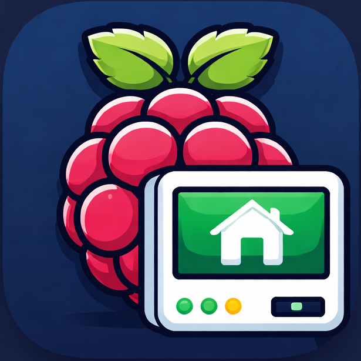

<div align="center">
  
</div>

# Homelab Portal 🏠

A lightweight, containerized dashboard for monitoring a homelab of one or many
machines. Built with React, Node.js and Docker.

<div align="center">

## Architecture

</div>

One image, two roles.

```
                    Browser
                       │  one origin, one URL
                       ▼
        ┌──────────────────────────────┐
        │  HUB  (Raspberry Pi)         │
        │  dashboard + node registry   │
        │  + its own metrics           │
        └──────────────┬───────────────┘
                       │ WebSocket, REST fallback
        ┌──────────────┴───────────────┐
        ▼                              ▼
  ┌───────────┐                  ┌───────────┐
  │  AGENT    │                  │  AGENT    │
  │  Jelly    │                  │  NAS …    │
  └───────────┘                  └───────────┘
```

- **Hub** — serves the dashboard, owns the node registry and the service links,
  collects its own hardware, and aggregates every agent. One per fleet.
- **Agent** — reports a single machine. No UI, no database.

The browser only ever talks to the hub, so agents need no CORS configuration
and do not have to be reachable from wherever you happen to be browsing.

**Channels.** Metrics are addressed per node — `node:jelly:metrics:system`.
Two channels are fleet-level: `fleet` (one summary row per node, driving the
overview strip) and `nodes` (registry and reachability changes).

**Collection is demand driven.** Nothing is sampled anywhere until a browser
subscribes to it, and collection stops when the last viewer navigates away,
collapses the panel or hides the tab. A node nobody is looking at costs
nothing beyond its summary line.

<div align="center">

## Features

</div>

- **Multi-node monitoring**
  - Fleet overview strip: CPU, RAM, temperature, disk and container counts for
    every machine at once
  - Click any node to focus the detailed panels on it
  - Per-node reachability with latency testing
  - Add, test and remove nodes from the UI
- **Real-time System Monitoring**
  - CPU load and usage, memory, CPU temperature
  - Disk usage per mount point
  - Process monitor with search, sort and filtering
  - Live network traffic per interface
- **Docker Container Management**
  - View and control containers (start / stop / restart) on any node
  - Driven by the Docker event stream rather than polling
- **Modules**
  - Pull other projects into the dashboard as first-class panels
  - A module supplies data and what it means; the portal decides how to draw it
  - Switch a dataset between list, grid and table without touching the service
  - Quick links are modules that report nothing — one registry, not two
- **Customizable Dashboard**
  - Panels flow into as many columns as the screen allows, filling gaps
  - Each panel can be compact, wide or full width
  - Drag-and-drop reordering, collapsible panels
  - Per-panel live/poll toggle
  - Switch nodes with `1`-`9`, or step through them with `[` and `]`
  - Panels show when data is stale, and say which node is unreachable
    rather than loading indefinitely
  - Preferences saved to localStorage

<div align="center">

## Tech Stack

</div>

- **Frontend**: React 18 + Vite, Tailwind CSS, Lucide Icons, dnd-kit,
  TanStack Virtual
- **Backend**: Node.js + Express + ws
- **Database**: SQLite (better-sqlite3), migrated on startup
- **Monitoring**: direct procfs/sysfs reads, systeminformation, dockerode
- **Deployment**: Docker + Docker Compose

<div align="center">

## Quick Start

</div>

### 1. Deploy the hub

On the machine that should serve the dashboard:

```bash
git clone https://github.com/JasonNuttall/PiPortal.git
cd PiPortal
docker compose up -d
```

Open `http://<that-host>:1781`. It monitors itself out of the box — a
single-machine install needs no further configuration.

### 2. Add another machine

On each additional machine:

```bash
git clone https://github.com/JasonNuttall/PiPortal.git
cd PiPortal
docker compose -f docker-compose.agent.yml up -d
```

An agent serves no dashboard — opening port 3001 in a browser is expected to
show nothing useful. Confirm it is alive with:

```bash
curl http://localhost:3001/health
# {"status":"ok","role":"agent","node":"jelly", ...}
```

Then in the dashboard choose **Manage nodes**, and add it:

| Field | Example | Notes |
| --- | --- | --- |
| Name | `Jelly` | Display name, free text |
| Id | `jelly` | Letters, numbers and hyphens only; used in channel names |
| Agent URL | `http://jelly:3001` | Must be resolvable **from the hub** |
| Token | blank | Only if the agent sets `AGENT_TOKEN` |

The URL is dialled by the hub, not by your browser, so it has to work from the
hub's network. If the hub cannot resolve the hostname, use the agent's IP
address instead.

Press **Test** to confirm reachability and see the round-trip latency. The node
appears in the fleet strip immediately.

Nothing is collected on a node until someone is looking at it, so an idle agent
costs almost nothing beyond its summary line.

### Upgrading an existing single-machine install

Your existing deployment becomes the hub and keeps working; there is nothing to
migrate by hand. The database is upgraded in place on first start, and service
links created before the upgrade become fleet-wide rather than disappearing.

```bash
git pull
docker compose up -d --build
```

The `--build` is required, not optional: the WebSocket moved to `/ws` on the
page's own origin, so the frontend image carries a new nginx config. Restarting
without rebuilding leaves the dashboard loading but never streaming.

To roll back, check out the previous commit and rebuild. The schema change is
additive, so the older code still reads the upgraded database.

<div align="center">

## Configuration

</div>

Both roles read the same variables; see `backend/.env.example`.

| Variable | Default | Meaning |
| --- | --- | --- |
| `NODE_ROLE` | `hub` | `hub` or `agent` |
| `PORT` | `3001` | HTTP + WebSocket port |
| `NODE_ID` | hostname | Stable id used in channel names |
| `NODE_NAME` | hostname | Display name in the fleet |
| `AGENT_TOKEN` | unset | Shared secret; unset disables auth |
| `DB_PATH` | `./data/homelab.db` | Hub only |
| `HOST_PROC` | `/proc` | Where the host's procfs is mounted |
| `HOST_ROOT` | `/host` | Where the host root is mounted |
| `HOST_SYS` | `/sys` | Where sysfs is mounted |
| `PROCESS_LIMIT` | `150` | Max processes returned |
| `AGENT_TIMEOUT_MS` | `8000` | Hub's patience with an agent |
| `CORS_ORIGIN` | unset | Comma-separated allowlist |

### Authentication

Leaving `AGENT_TOKEN` unset is the right choice on a trusted LAN. Set it on any
agent reachable more widely, and enter the same value as that node's **Token**
on the hub. It is checked in constant time on both `/api` requests and
WebSocket upgrades, and is never returned by the API.

<div align="center">

## API

</div>

### Fleet (hub)

| Method | Path | Purpose |
| --- | --- | --- |
| `GET` | `/api/nodes` | Registry with live status |
| `GET` | `/api/nodes/fleet` | Overview strip payload |
| `POST` | `/api/nodes` | Register an agent |
| `PUT` | `/api/nodes/:id` | Edit a node |
| `DELETE` | `/api/nodes/:id` | Remove a node |
| `POST` | `/api/nodes/:id/test` | Probe reachability |

### Per-node metrics (hub)

`GET /api/nodes/:id/<channel>`, where the channel's colons become slashes:

```
/api/nodes/jelly/metrics/system
/api/nodes/jelly/metrics/temperature
/api/nodes/jelly/metrics/network
/api/nodes/jelly/metrics/disk
/api/nodes/jelly/metrics/processes
/api/nodes/jelly/docker/containers
/api/nodes/jelly/docker/info
/api/nodes/jelly/summary
```

`POST /api/nodes/:id/docker/containers/:containerId/:action` — `start`,
`stop` or `restart`.

### Local metrics (both roles)

The same channels are served for the machine itself under `/api/local/...`,
which is what a hub calls on its agents. `?fresh=1` bypasses the cache.
`GET /api/local/info` returns that node's identity.

<div align="center">

## Writing a module

</div>

A module is one HTTP endpoint on your own service. The portal never runs module
code and never renders module HTML — it reads data and draws it with its own
components, which is what lets the same payload be a list, a grid or a table.

Expose `GET /portal/module`:

```json
{
  "contract": 1,
  "id": "missedanep",
  "title": "Missed an Ep",
  "href": "http://jelly:3014",
  "status": "ok",
  "ttl": 300,
  "datasets": [
    { "id": "missing", "label": "Missing episodes",
      "shape": "metric", "value": 7, "tone": "warn" },

    { "id": "upcoming", "label": "Airing soon",
      "shape": "schedule", "suggests": "list", "window": true,
      "items": [
        { "id": "sev-s02e07", "title": "Severance", "subtitle": "S02E07",
          "date": "2026-08-21", "image": "https://.../poster.jpg",
          "href": "http://jelly:3014/series/95396",
          "detail": [{ "label": "Network", "value": "Apple TV+" }] }
      ] }
  ]
}
```

### Shapes

| Shape | Data | Views |
| --- | --- | --- |
| `metric` | one number, optionally against `max` | stat, gauge |
| `collection` | items with no inherent order | list, grid, table |
| `schedule` | items that each carry a `date` | calendar, agenda, list, grid, table |
| `series` | `points` of `{ t, v }` | spark\*, chart\* |

Set `"window": true` on a `schedule` and the portal will send `?from=` and
`?to=` when its calendar pages to another month. Without it the calendar draws
only what it was given and disables navigation, rather than showing empty
months as though they were genuinely empty.

`spark` and `chart` are not built yet; a dataset asking for one says so rather
than drawing something else.

### Item fields

`id`, `title`, `subtitle`, `meta`, `date`, `image`, `href`, `tone`
(`ok`/`warn`/`error`), and `detail[]` of `{ label, value }`. Anything else is
dropped — a field only one view understands would vanish when the view changes.

### Rules the portal enforces

- Only `http`/`https` URLs survive; `javascript:` and `data:` are stripped
- A `schedule` item without a parseable `date` is dropped
- Unknown shapes and unknown fields are ignored, never rendered
- `ttl` is clamped to 5–3600s — the service decides how often it is worth asking
- Images are proxied by the hub, and only URLs your payload referenced can be
  fetched
- The portal issues `GET` only. Modules report; they cannot be commanded.

### Registering it

**Manage** in the dashboard → add a module with your service's base URL. The
portal appends `/portal/module`. Add a token if your endpoint requires one; it
is stored on the hub and never returned by the API. Press **Test** to see the
datasets it found.

If the service is only reachable from one machine, set that node as the
module's `via` so the agent fetches on the hub's behalf.

<div align="center">

## Development

</div>

```bash
cd backend  && npm install && npm run dev    # http://localhost:3001
cd frontend && npm install && npm run dev    # http://localhost:3000
npm test                                     # in either directory
```

To develop against a second machine without deploying, run a local agent:

```bash
cd backend
NODE_ROLE=agent PORT=3002 NODE_ID=testnode npm start
```

then register `http://localhost:3002` in the UI.

<div align="center">

## Troubleshooting

</div>

**A node shows as offline.** Press **Test** under Manage nodes. Check the agent
is up (`curl http://<host>:3001/health`) and that the URL uses a hostname the
hub can resolve. If the agent sets `AGENT_TOKEN`, the node's Token must match.

**No temperature.** Sensors are discovered automatically from
`/sys/class/thermal` (Pi and most ARM boards) and `/sys/class/hwmon`
(AMD `k10temp`, Intel `coretemp`). Confirm the container can see them:
`docker exec homelab-portal-backend ls /sys/class/hwmon`.

**Disks missing.** Universal disk detection needs `/:/host:ro` and `pid: "host"`
so the host mount table is readable.

**Processes show only the container's.** `pid: "host"` and `/proc:/host/proc:ro`
must both be present.

**Dashboard loads but nothing streams.** The WebSocket is served at `/ws` on
the same origin as the page. Behind your own reverse proxy, forward `/ws` with
`Upgrade` and `Connection` headers set.

<div align="center">

## License

</div>

MIT
